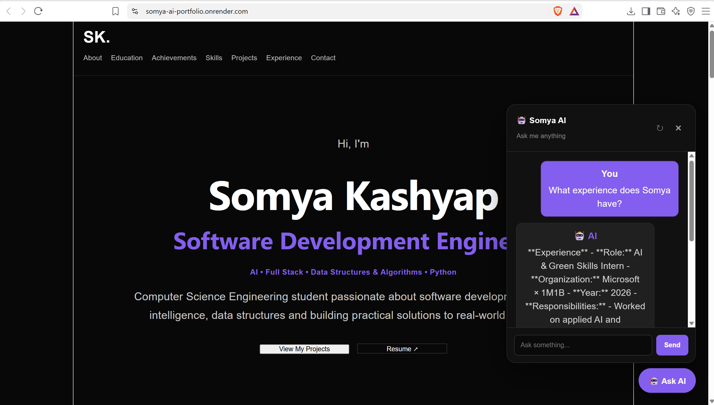
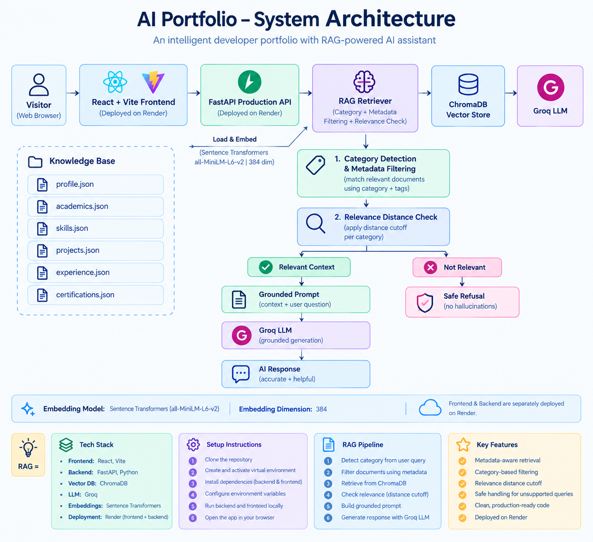

# Somya Kashyap — AI Portfolio 🤖

A full-stack developer portfolio with a production RAG-powered AI assistant that answers questions about my projects, skills, education, experience, and certifications using a curated portfolio knowledge base.

## 🌐 Live Demo

**Portfolio:**  
https://somya-ai-portfolio.onrender.com

**Production API:**  
https://somya-ai-portfolio-api-v2.onrender.com

**API Documentation:**  
https://somya-ai-portfolio-api-v2.onrender.com/docs

---

## ✨ Features

- 🤖 AI assistant integrated directly into the portfolio
- 🔎 Custom Retrieval-Augmented Generation (RAG) pipeline
- 🏷️ Category detection and metadata-aware retrieval
- 🎯 Relevance filtering using distance cutoffs
- 🛡️ Safe handling of unsupported questions
- 📱 Responsive portfolio and mobile navigation
- 💬 Suggested AI questions and chat history
- 🔄 New chat and automatic chat scrolling
- 🚀 Frontend and backend deployed separately on Render
- 🧪 Retrieval regression tests

---

## 🖼️ Portfolio Preview



---

## 🏗️ System Architecture



### High-Level Flow

```text
Visitor
   ↓
React + Vite Frontend
   ↓
FastAPI Production API
   ↓
Category Detection
   ↓
Metadata Filtering
   ↓
ChromaDB Vector Search
   ↓
Relevance / Distance Check
   ↓
Relevant Context
   ↓
Groq LLM
   ↓
Grounded AI Response